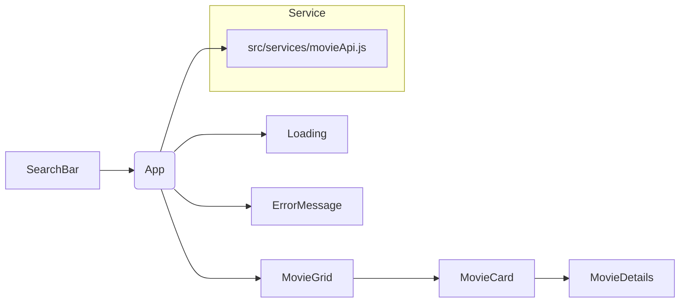

# CineScope — Week 4 Documentation

Version: 1.0

Project: CineScope — a ReactJS + Vite application that searches the OMDb API and displays movie information dynamically.

This document explains the implementation, architecture, design decisions, and testing performed during Week 4 of the internship. It focuses on analytical rationale behind choices, trade-offs considered, and concrete details to help maintainers and reviewers understand both what was built and why.

**Repository files referenced in this document:**
- Main entry & app: [src/main.jsx](src/main.jsx)
- App shell: [src/App.jsx](src/App.jsx)
- API service: [src/services/movieApi.js](src/services/movieApi.js)
- Components: [src/components](src/components)
- This documentation: [WEEK4_DOCUMENTATION.md](WEEK4_DOCUMENTATION.md)

## Project Goals

- Provide a responsive, accessible UI to search and browse movies via the OMDb API.
- Keep API logic separated from UI components for testability and reusability.
- Handle real-world API concerns robustly: loading states, partial results, network errors, rate limits, and secure API key handling.
- Deliver clear, maintainable component boundaries and state management using React primitives.

## High-level Architecture

CineScope follows a simple, component-driven architecture. Responsibility is divided between:

- The UI layer (React components under `src/components`) which renders state and user interactions.
- The service layer (`src/services/movieApi.js`) which encapsulates all network/API logic, transformations, and error handling.
- App-level state (in `App.jsx`) that orchestrates search input, results, selection, and global UI states such as loading and error.

Rationale: This separation keeps components focused on presentation and interaction, while a single service module centralizes API concerns such as error normalization and URL composition. Centralizing API logic reduces duplication, simplifies unit testing, and improves future extensibility (for example, switching API providers).

Mermaid component diagram (simplified):



## Components & Design Decisions

Each component is implemented with a clear single responsibility. Below are the components and the analytic reasoning behind their structure.

- `Header` — Provides app title and branding. Kept intentionally minimal to avoid distracting cognitive load from the search flow.

- `SearchBar` — Controlled component that lifts search input to the parent `App`. Design choices:
	- Controlled input to keep canonical source of truth in app-level state.
	- The `SearchBar` does not implement debounced input; searches are triggered when the user presses Enter or clicks the Search button. Debounced search could be added in the future to reduce unnecessary requests and help manage API rate limits.

- `MovieGrid` — Responsible for layout of results. Uses CSS grid for responsive behavior. Rationale: grid provides consistent control over rows/columns and gaps across breakpoints.

- `MovieCard` — Presentation card for each movie. Shows poster (with proper fallback), title, year, and action to open `MovieDetails`. Accessibility: images have alt text derived from title; buttons have labels.

- `MovieDetails` — Renders extended details implemented as a modal. Rationale: the modal keeps the user in context with the search results. Route-based detail pages (deep links/bookmarkable URLs) are a possible future enhancement.

- `Loading` — Small, reusable indicator component shown during async operations.

- `ErrorMessage` — Presents normalized error messages and a retry action. The component receives a retry callback so it remains presentation-only and the parent controls what retry does.

- `EmptyState` — Explicit messaging when no results are found. This avoids ambiguous blank UI and gives actionable suggestions (e.g., try a different query).

Design trade-offs considered:

- Local component state vs global store: App uses React local state rather than Redux or Context. Reason: scope of state is small and well-contained; adding a global store would increase complexity without clear benefit for this scale.
- Modal vs route for details: Modal keeps flow quick; route would require adding a router (React Router) but improves linkability. Chosen: modal for Week 4 scope.

## API Service: `src/services/movieApi.js`

All network interactions are centralized in `src/services/movieApi.js`.

Key responsibilities implemented:

- Compose request URLs using environment variable `VITE_OMDB_API_KEY`.
- Provide two main functions: `searchMovies(searchTerm)` and `getMovieDetails(imdbID)`.
- Normalize responses into a consistent shape so components receive predictable payloads.
- Surface normalized error messages (the service throws `Error` instances with user-friendly messages that the UI displays).

Design rationale and defensive practices:

- Environment variable usage: the API key is accessed through `import.meta.env.VITE_OMDB_API_KEY`. The repository includes `.env.example` with a placeholder and excludes `.env` via `.gitignore` to prevent accidental leakage. This protects the key from Git history exposure.

- Async/await: chosen for clarity and linear control flow. All calls are wrapped in try/catch to surface both API-level errors (OMDb returns an error message) and network errors (fetch throws).


- Timeouts and cancellation: `AbortController` is not implemented in the current codebase. Adding request cancellation would increase responsiveness and avoid rendering stale results when users issue new searches before prior requests finish; this is listed under Future Improvements.

- Retry strategy: the UI exposes a retry button via `ErrorMessage`. For transient network errors, exponential backoff could be added in `movieApi.js`. For Week 4 the manual retry was implemented to keep control with the user and avoid background retries that may complicate UX (e.g., repeated retries during intermittent connectivity).


- Rate limits and pagination: OMDb has a free-tier rate limit. Pagination (using OMDb's `page` parameter) is not implemented in the current `searchMovies` function nor is infinite scrolling implemented in the UI. Pagination and careful rate-limit handling are listed under Future Improvements.

## State Management (what lives where)

- `searchInput` (App-level): controlled by `SearchBar`, used for issuing searches.
- `movieResults` (App-level): array of movie summaries returned by `searchMovies`.
- `loading` (App-level): boolean representing an active search request.
- `selectedMovie` (App-level): id or object for the currently opened `MovieDetails`.

 - `error` (App-level): string message describing the last failure (sourced from `Error.message`).
 - `selectedMovie` (App-level): id or object for the currently opened `MovieDetails`.
- `detailsLoading` / `detailsError`: state slices for fetching details separately from search results.

Reasoning: centralizing these pieces at the App level simplifies passing callbacks and state down to children. Because the app is small, Context or global stores aren't necessary and would add indirection.

## Error Handling & UX

Errors are categorized and handled differently:

- Network errors (e.g., fetch fail): show `ErrorMessage` with a clear prompt to retry.
- API errors (OMDb-specific messages): show the API-provided message (normalized) in the `ErrorMessage` component.
- Empty results (valid response but no results): show `EmptyState` with suggestions.

UX choices and rationale:

- Provide an inline retry button so users choose whether to attempt again; avoids unexpected background retries.
- Use a dedicated `Loading` component to avoid UI layout shift — the loading indicator occupies predictable space.
- Preserve previous results while a new request is pending (optimistic behavior) was considered, but we chose to clear results on a fresh explicit search to avoid mismatch between query and visible results. For a follow-up enhancement, keep-last-results-while-loading could be enabled.

## Accessibility & Responsiveness

- Visual: responsive CSS grid in `MovieGrid` ensures the layout adapts across mobile, tablet, and desktop breakpoints.
- Semantic HTML: buttons, headings, and images include accessible attributes (alt text, aria-labels where appropriate).
- Keyboard: interactive elements are focusable and actionable via keyboard.

Design rationale: accessibility was treated as a first-class concern — simple semantic markup scales better than heavy ARIA workarounds and reduces maintenance cost.

## Environment & Security

- API key: stored in `.env` under `VITE_OMDB_API_KEY`. Example file `.env.example` contains a placeholder only.
- Never commit `.env` — ensure `.gitignore` contains this file. Avoid printing the key in logs. Build artifacts should not include the raw key in public places; Vite embeds env variables at build time as constants, so be mindful that the production bundle will contain the key if the app runs client-side. For public API keys, prefer server-side proxy when the provider requires more secrecy.

Notes on public client keys: OMDb API keys for small demo apps are often public-facing. If you require stronger secrecy, implement a server-side proxy that stores the key and forwards requests.

## Testing, Linting, and Build

The project uses basic linting and build verification as part of validation.

Commands run during development and verification:

```bash
npm run lint
npm run build
```

- `lint` checks formatting and common issues; it helps maintain consistency.
- `build` verifies the production build completes without errors and that the bundler can resolve all modules.

Notes: Unit tests were not added in Week 4 to keep scope manageable. Recommended next steps include adding unit tests for `movieApi.js` (mocking fetch) and component snapshot or behavior tests using React Testing Library.

## Known Limitations & Future Enhancements

The current implementation is functional and robust for Week 4 goals. The following improvements are concrete, prioritized items that would increase quality and maintainability if implemented:

1. Request cancellation using `AbortController` to avoid rendering stale results when multiple requests are issued in quick succession.
2. Debounced search input (200–400ms) to reduce unnecessary API requests and improve perceived performance.
3. Pagination / infinite scroll using OMDb's `page` parameter to support larger result sets without overloading the UI or the API.
4. Exponential backoff retry strategy in the API service for transient network failures (with a configurable maximum retry cap).
5. Client-side caching for movie details or recent search responses to reduce repeated requests and speed up UX for repeated accesses.
6. Move sensitive API calls behind a minimal server-side proxy when deploying to production environments that require stricter key secrecy.
7. Add unit tests for `movieApi.js` (mocking `fetch`) and integration tests for component flows using React Testing Library.
8. Implement route-based deep linking for `MovieDetails` to enable sharing and bookmarking of specific movie pages.

## Implementation Notes & Tips for Maintainers

- API module currently exports small async functions that return normalized JSON or throw `Error` instances with user-friendly messages. For improved programmatic error handling in the future, consider migrating to explicit structured error types.
- Keep presentation components pure — they should accept props and callbacks only. Move data fetching and side effects to parent components or hooks.
- If adding a global store later, extract only cross-cutting concerns (e.g., user preferences, auth) rather than moving local UI state prematurely.

## Summary of Week 4 Work

- Built a searchable UI backed by OMDb.
- Centralized API logic in `src/services/movieApi.js` using `async/await` and error handling that surfaces normalized user-facing messages.
- Implemented responsive components: `MovieGrid`, `MovieCard`, `MovieDetails`, and baseline accessibility.
- Handled loading, error states, empty results, and provided a retry UX.
- Verified linting and successful production build.

If you'd like, I can now:

- Add `AbortController`-based cancellation and wire it into `SearchBar`.
- Implement a debounced input in `SearchBar` to reduce API calls.
- Add unit tests for `movieApi.js` with mocked fetch.

Tell me which follow-up you'd prefer and I will add it to the plan.

